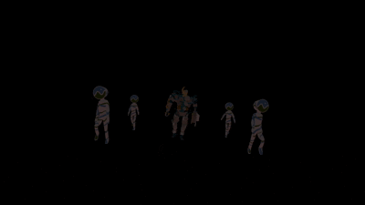

<div align="center">
	<h1>VulkanRust</h1>
	<h3><i>A personal Vulkan project in Rust (the name is a work in progress)</i></h3>
	<a href="https://github.com/magjico/VulkanRust/blob/main/LICENSE"></a>
</div>


<br>
<p align="center">
  
</p>
</br>


## What is VulkanRust?

VulkanRust is a **work in progress** 3D rendering engine designed to enable real-time simulation with photorealistic lighting and models.
It draws primarily on techniques used in game engines and robotic simulation.

For now, this tool only supports the loading of 3D models and their animations.
Initially, this project will evolve to incorporate real-time rendering and physics techniques, and then, in a second phase, it will focus on the simulation of robotic arms in a 3D environment.

## Build documentation

```powershell
cargo doc --no-deps --open
```

## Features

### Rendering

* **Vulkan 1.3 dynamic rendering**: no render passes or framebuffers and attachments are declared per frame.
* **Multisample anti-aliasing** with resolve into the swapchain image.
* **Depth testing** against a dedicated depth attachment.
* **Dynamic viewport and scissor**, so the pipeline survives window resizes without being rebuilt.

### Physically Based Shading

* **Cook-Torrance BRDF** with the GGX/Trowbridge-Reitz normal distribution, the Smith geometry term (Schlick-GGX approximation) and Schlick's Fresnel approximation.
* **Metallic-roughness workflow**, following the glTF 2.0 material model.
* **Full PBR texture set**: base color, metallic-roughness, normal, occlusion and emissive, each with a configurable UV set.
* **Normal mapping** through a per-fragment TBN basis built from vertex tangents.
* **Alpha masking** with a per-material cutoff.
* **HDR tone mapping** and **gamma correction** with adjustable exposure.

### Asset Import

* **glTF 2.0 import**: meshes, materials, textures (KTX2-Basis Universal not yet supported), skeletons and animations.
* **.obj import**

### Animation and Skinning

* **Skeleton Animation**
* **Linear blend skinning**
* **Keyframe interpolation**

### Instanced Rendering

* **One draw call per (model, node, primitive) group**
* **Per-instance data in a storage buffer**
* **Slot allocation** for the shared skinning buffer, so each instance owns a private range of joint matrices

## Acknowledgments

* [Vulkan Rust Tutorial](https://kylemayes.github.io/vulkanalia/introduction.html)
* [Official Vulkan Documentation](https://docs.vulkan.org/spec/latest/index.html)
* [KhronosGroup resources](https://github.com/KhronosGroup)
* [bevy ECS library](https://docs.rs/bevy_ecs/latest/bevy_ecs/)

## Resources

* [GLB / GLTF](https://github.com/KhronosGroup/glTF-Sample-Models)